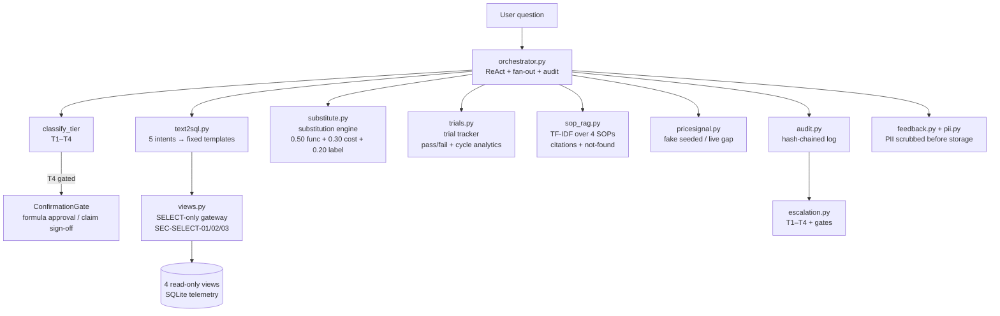

# Architecture

```mermaid
flowchart TB
    U[User question] --> O[orchestrator.py<br/>ReAct + fan-out + audit]
    O --> T[classify_tier<br/>T1–T4]
    T -->|T4 gated| G[ConfirmationGate<br/>formula approval / claim sign-off]
    O --> Q[text2sql.py<br/>5 intents → fixed templates]
    Q --> GW[views.py<br/>SELECT-only gateway<br/>SEC-SELECT-01/02/03]
    GW --> V[(4 read-only views<br/>SQLite telemetry)]
    O --> S[substitute.py<br/>substitution engine<br/>0.50 func + 0.30 cost + 0.20 label]
    O --> TR[trials.py<br/>trial tracker<br/>pass/fail + cycle analytics]
    O --> R[sop_rag.py<br/>TF-IDF over 4 SOPs<br/>citations + not-found]
    O --> P[pricesignal.py<br/>fake seeded / live gap]
    O --> A[audit.py<br/>hash-chained log]
    O --> F[feedback.py + pii.py<br/>PII scrubbed before storage]
    A --> E[escalation.py<br/>T1–T4 + gates]
```
